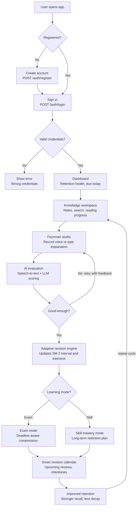

# MindEcho

> **Adaptive Spaced Retention & Feynman Learning Platform**
> *Developed for SIH 2026 — Team: All Six Not Found*

[](https://nodejs.org/)
[](https://react.dev/)
[](https://vitejs.dev/)
[](https://fastify.dev/)
[](https://www.typescriptlang.org/)
[](https://tailwindcss.com/)
[](https://www.mongodb.com/)
[](LICENSE)

---

## 📌 Table of Contents

* [Executive Product Overview](#-executive-product-overview)
* [Key Features](#-key-features)
* [Scientific Foundation & Algorithms](#-scientific-foundation--algorithms)
* [System Workflow](#-system-workflow)
* [Monorepo Architecture](#-monorepo-architecture)
* [Tech Stack](#-tech-stack)
* [Quick Start & Setup](#-quick-start--setup)
* [Available Scripts Reference](#-available-scripts-reference)
* [Frontend Pages & Route Map](#-frontend-pages--route-map)
* [Backend API Specification](#-backend-api-specification)
* [Environment Variables Configuration](#-environment-variables-configuration)
* [Docker & Infrastructure](#-docker--infrastructure)
* [Team & Acknowledgments](#-team--acknowledgments)

---

## 💡 Executive Product Overview

**MindEcho (LECTOR / MindEcho)** is an intelligent cognitive learning ecosystem designed to eliminate the **Illusion of Competence**—the phenomenon where passive reading creates a false sense of mastery, only for memory to rapidly decay following Hermann Ebbinghaus's Forgetting Curve.

By synthesizing the **Feynman Technique** (explaining complex concepts in simple terms) with an **Adaptive Spaced Repetition Engine (SuperMemo SM-2)**, MindEcho transforms passive study into active recall and lifelong mastery.

### The Problem

* **Passive Memory Decay**: Learners lose up to 70% of new knowledge within 24 hours without structured active recall.
* **Fixed-Interval Calendars**: Standard study planners use rigid review intervals that fail to accommodate individual memory strength or sudden exam deadlines.

### The Solution

1. **Feynman Voice & Text Practice Studio**: Capture spoken audio or written explanations of study concepts.
2. **AI Comprehension Evaluation**: Multi-modal evaluation (Whisper STT + LLM scoring) analyzes simplicity, accuracy, and missing key ideas.
3. **Adaptive Retention Curves**: Dynamic calculation of memory decay ($R = e^{-t/S}$) and optimal review windows based on evaluation scores.
4. **Dual Study Modes**:

   * **Exam Mode**: Dynamically compresses revision intervals to guarantee 100% topic coverage prior to a target exam date.
   * **Skill Mastery Mode**: Gradually expands review windows for sustainable, lifelong retention.
5. **Notion-Style Knowledge Hub**: Workspace with interactive notes, live reading progress indicators, search/filter, and instant practice triggers.

---

## ✨ Key Features

### 🎙️ Feynman Technique Audio & Text Studio

* Record verbal explanations directly via the Web Audio API or type simplified summaries.
* Automatic Speech-to-Text (STT) transcription.
* Multi-dimensional scoring (Clarity, Key Concept Coverage, Simplicity) with actionable improvement tips.

### 📅 Adaptive Spaced Repetition Calendar

* Visual calendar showing upcoming review schedules color-coded by retention health.
* Switch seamlessly between **Exam Mode** and **Skill Mastery Mode**.
* Set critical milestones and exam dates with real-time schedule auto-adjustment.

### 📚 Notion-Style Interactive Workspace

* Markdown editor and viewer for structured course notes.
* Live `ReadingProgress` tracking bar with estimated reading time (words-per-minute).
* One-click launch into practice tests for any note.

### 📊 Learning Analytics & Retention Dashboard

* Retention health score matrix tracking overall knowledge decay across subjects.
* "Due Today" item queue for high-priority review sessions.
* Interactive charts and streak counters to boost learner engagement.

### 💳 Tiered LLM Token & Payment System

* Sleek starfield pricing UI with monthly/annual discount toggles and interactive checkout interface.

---

## 🔬 Scientific Foundation & Algorithms

### 1. Ebbinghaus Forgetting Curve

Memory retention decay is modeled as:
\(R = e^{-\frac{t}{S}}\)

where:

* $R$ = Retrievability / Memory Retention (0.0 to 1.0)
* $t$ = Time elapsed since last review (days)
* $S$ = Memory Stability (calculated from review performance history)

### 2. SuperMemo SM-2 Interval Update Logic

After each practice session with quality score $q \in [0, 5]$ (mapped from LECTOR 1-10 score):

\(EF' = \max\left(1.3, \, EF + \left(0.1 - (5 - q) \times (0.08 + (5 - q) \times 0.02)\right)\right)\)

$$$I(n) = \begin{cases} 
1 & \text{if } n = 1 \\
6 & \text{if } n = 2 \\
I(n-1) \times EF' & \text{if } n > 2 
\end{cases}$$

### 3. Exam Mode Dynamic Compression
When **Exam Mode** is enabled with a target date $T_{\text{exam}}$, review intervals $I(n)$ are scaled by a compression factor $C$:
$$C = \min\left(1.0, \, \frac{T_{\text{exam}} - T_{\text{current}}}{\sum I(n)}\right)$$

---

## System Workflow



---

## 🏗️ Monorepo Architecture

The project is structured as an `npm` monorepo workspace:

```text
MindEcho/
├── apps/
│   ├── web/                    # Frontend React 19 SPA (Vite + Tailwind v4)
│   │   ├── src/
│   │   │   ├── components/     # UI components (Grid, Calendar, Audio Recorder, etc.)
│   │   │   ├── context/        # React Context (AuthContext, NotesContext)
│   │   │   ├── pages/          # Landing, Dashboard, Workspace, Feynman Studio, Calendar, Payment
│   │   │   └── types/          # TypeScript interfaces & state schemas
│   │   ├── index.css           # Vanilla CSS tokens & Tailwind CSS imports
│   │   └── vite.config.ts      # Vite configuration & path aliases
│
│   └── api/                    # Backend REST API (Fastify 5 + TypeScript)
│       ├── src/
│       │   ├── config/         # Zod environment variable parsing & validation
│       │   ├── db/             # MongoDB Mongoose connection
│       │   ├── models/         # Mongoose schemas (User, Note, Evaluation, CalendarSettings)
│       │   ├── modules/        # API domain controllers, routes, and services
│       │   ├── plugins/        # Fastify plugins (CORS, JWT, Rate Limit, Helmet)
│       │   ├── workers/        # Retention decay & background cron schedulers
│       │   └── server.ts       # Application entry point & Fastify listener
│       └── migrate-mongo-config.cjs # Mongo database migration scripts
│
├── docs/                       # System architecture diagrams & specs
├── docker-compose.yml          # Container configuration for MongoDB, Redis, MinIO
├── package.json                # Monorepo root configuration & scripts
├── PRODUCT.md                  # Detailed product handover specification
└── SETUP.txt                   # Quick start reference
```

---

## 🛠️ Tech Stack

| Domain | Technology | Description |
|---|---|---|
| **Frontend Core** | React 19, TypeScript 6, Vite 8 | High-performance single page application |
| **Frontend Styling** | Tailwind CSS v4, Custom CSS Tokens | Modern glassmorphism & Dark Mocha / Warm Gold theme |
| **Frontend UI/Anim** | Framer Motion, Lucide React, Canvas Confetti, NumberFlow | Micro-animations, responsive graphics & feedback |
| **Routing & State** | React Router v7, React Context API | Client-side routing and synchronized state |
| **Backend Core** | Fastify 5, Node.js >=20, TypeScript | Low-overhead, high-throughput REST API |
| **Database** | MongoDB 7, Mongoose 8 | Document storage for users, notes, and evaluations |
| **Cache & Queue** | Redis 7 | Caching, session store, and background rate limiting |
| **Object Storage** | AWS S3 / MinIO | Local & cloud storage for user audio recordings |
| **Validation & Auth** | Zod, Jose (JWT), Bcrypt | Schema validation and secure authentication |
| **Containerization** | Docker, Docker Compose | Orchestration for local infrastructure |

---

## 🚀 Quick Start & Setup

### Prerequisites
- **Node.js**: `v20.0.0` or higher
- **npm**: `v10.0.0` or higher
- **Docker Desktop** (optional, recommended for database services)

### Installation

1. **Clone the repository:**
   ```bash
   git clone https://github.com/skapiljain/MindEcho.git
   cd MindEcho
   ```

2. **Install monorepo dependencies:**
   ```bash
   npm install
   ```

3. **Start local infrastructure (MongoDB, Redis, MinIO):**
   ```bash
   npm run docker:up
   ```

4. **Run database migrations (Optional):**
   ```bash
   npm run migrate:up
   ```

5. **Start development servers:**
   ```bash
   # Run both Web Frontend and API Backend concurrently (RECOMMENDED)
   npm run dev:all
   ```

   - **Web App**: Access at [http://localhost:45002](http://localhost:45002)
   - **API Server**: Access at [http://localhost:3000](http://localhost:3000)
   - **API Health Check**: [http://localhost:3000/api/v1/health](http://localhost:3000/api/v1/health)

---

## 📜 Available Scripts Reference

Run these commands from the root directory:

| Script | Command | Purpose |
|---|---|---|
| `npm run dev:all` | `concurrently -n web,api "npm run dev:web" "npm run dev:api"` | Launches both frontend web app and backend API concurrently |
| `npm run dev` / `npm run dev:web` | `npm run dev --workspace=@lector/web` | Starts the Vite dev server for `@lector/web` on port `45002` |
| `npm run dev:api` | `npm run dev --workspace=@lector/api` | Starts Fastify API server with hot-reloading (`tsx watch`) on port `3000` |
| `npm run build` | `npm run build --workspaces --if-present` | Compiles TypeScript and builds production bundles for all workspace packages |
| `npm run build:web` | `npm run build --workspace=@lector/web` | Builds production SPA artifacts for the frontend web application |
| `npm run build:api` | `npm run build --workspace=@lector/api` | Compiles backend API code into `dist/` |
| `npm run lint` | `npm run lint --workspaces --if-present` | Runs Oxlint and TypeScript static type checks |
| `npm run test` | `npm run test --workspace=@lector/api` | Runs Vitest unit and integration test suites for the API |
| `npm run docker:up` | `docker compose up -d` | Starts MongoDB (27017), Redis (6379), and MinIO (9000/9001) in background |
| `npm run docker:down` | `docker compose down` | Stops and removes infrastructure Docker containers |
| `npm run migrate:up` | `npm run migrate:up --workspace=@lector/api` | Executes pending MongoDB schema migrations |

---

## 🌐 Frontend Pages & Route Map

| Route | Component | Key Features & Purpose |
|---|---|---|
| `/` | `Home.tsx` / `Landing.tsx` | Hero section, problem breakdown, 4-Pillar solution cards, literature reference scroll, and team presentation |
| `/login` | `Login.tsx` | Demo user authentication page matching dark mocha design palette |
| `/dashboard` | `Dashboard.tsx` | Central learning dashboard with Retention Health matrix, Due Today queue, and Quick Practice launcher |
| `/subjects` | `NotionWorkspace.tsx` | Notion-style workspace for notes management, live `ReadingProgress` bar, search, filter, and note creator |
| `/concept/new` | `NewConcept.tsx` | Feynman Technique Practice Studio with Web Audio recorder, text input, and multi-dimensional LLM feedback |
| `/calendar` | `AdaptiveCalendar.tsx` | Interactive Spaced Repetition calendar with Exam Mode vs Skill Mode toggle, event milestones, and interval preview |
| `/payment` | `LLMPayment.tsx` | Interactive billing section with monthly/annual discount switch, plan cards (Free, Pro, Team), and checkout flow |

---

## 🔌 Backend API Specification

The Fastify server exposes REST endpoints under the `/api/v1` base route prefix:

### 1. Authentication (`/api/v1/auth`)
- `POST /api/v1/auth/register` — Create new user account.
- `POST /api/v1/auth/login` — Authenticate user and issue JWT bearer token.

### 2. Notes & Knowledge Base (`/api/v1/notes`)
- `GET /api/v1/notes` — Retrieve user's study notes list (supports search & subject filtering).
- `POST /api/v1/notes` — Create a new note item.
- `GET /api/v1/notes/:id` — Get note details.
- `PUT /api/v1/notes/:id` — Update note content/title.
- `DELETE /api/v1/notes/:id` — Remove note.

### 3. Feynman Evaluation Engine (`/api/v1/evaluations`)
- `POST /api/v1/evaluations/feynman` — Submit voice audio or text explanation for Feynman evaluation:
  - Transcribes audio via Speech-to-Text (STT).
  - Evaluates concept clarity and accuracy using LLM engine.
  - Updates SuperMemo SM-2 interval parameters (`easinessFactor`, `retentionHealth`, `nextReviewDate`).

### 4. Adaptive Calendar & Settings (`/api/v1/calendar`)
- `GET /api/v1/calendar/settings` — Get current study mode configuration (`exam` vs `skill`).
- `POST /api/v1/calendar/settings` — Update target exam date, title, and active mode.
- `GET /api/v1/calendar/important-dates` — List scheduled exam milestones.
- `POST /api/v1/calendar/important-dates` — Create important date entry.

### 5. System & Health (`/api/v1/health`)
- `GET /api/v1/health` — Returns status (`200 OK`) and database connectivity indicators.

---

## ⚙️ Environment Variables Configuration

Copy `.env.example` to `.env` in `apps/api` (or workspace root):

```env
# Server Config
NODE_ENV=development
HOST=0.0.0.0
PORT=3000
CORS_ORIGINS=http://localhost:43123,http://localhost:45002

# Database & Storage
MONGODB_URI=mongodb://localhost:27017/lector
REDIS_URL=redis://localhost:6379

# Authentication
JWT_SECRET=dev-secret-change-in-production-min-32-chars
JWT_ACCESS_EXPIRES_IN=15m
JWT_REFRESH_EXPIRES_IN=7d

# LLM & Speech AI Evaluation Providers
LLM_PROVIDER=mock          # Options: 'mock' | 'openai' | 'gemini' | 'claude'
OPENAI_API_KEY=your_openai_api_key_here
GEMINI_API_KEY=your_gemini_api_key_here

STT_PROVIDER=mock          # Options: 'mock' | 'whisper' | 'deepgram'

# Object Storage for Audio Recording Blobs
AUDIO_STORAGE=local        # Options: 'local' | 's3'
S3_ENDPOINT=http://localhost:9000
S3_ACCESS_KEY=lector
S3_SECRET_KEY=lector_dev_secret
S3_BUCKET=lector-audio
```

---

## 🐳 Docker & Infrastructure

The included `docker-compose.yml` spins up required local dependencies:

| Service | Container Name | Port | Description |
|---|---|---|---|
| **MongoDB** | `lector-mongodb` | `27017` | Main document database storing users, notes, and evaluations |
| **Redis** | `lector-redis` | `6379` | In-memory cache and session rate limiting |
| **MinIO** | `lector-minio` | `9000` (API), `9001` (Console) | S3-compatible local object store for recorded voice files |

---

## 👥Team & Acknowledgments

**Team: All Six Not Found**  
*SIH 2026 Hackathon Project*

- Built with modern web performance and cognitive neuroscience principles in mind.
- Special thanks to the open-source community behind React, TypeScript, Vite, Tailwind CSS, Fastify, Node.js, MongoDB, Mongoose, Redis, and Docker.
- Grateful to the researchers behind the SuperMemo SM-2 algorithm and Hermann Ebbinghaus's Forgetting Curve research, which underpin our spaced repetition engine.

---

<p align="center">Made with MindEcho — Empowering learners to master anything through active recall.</p>
$$$
